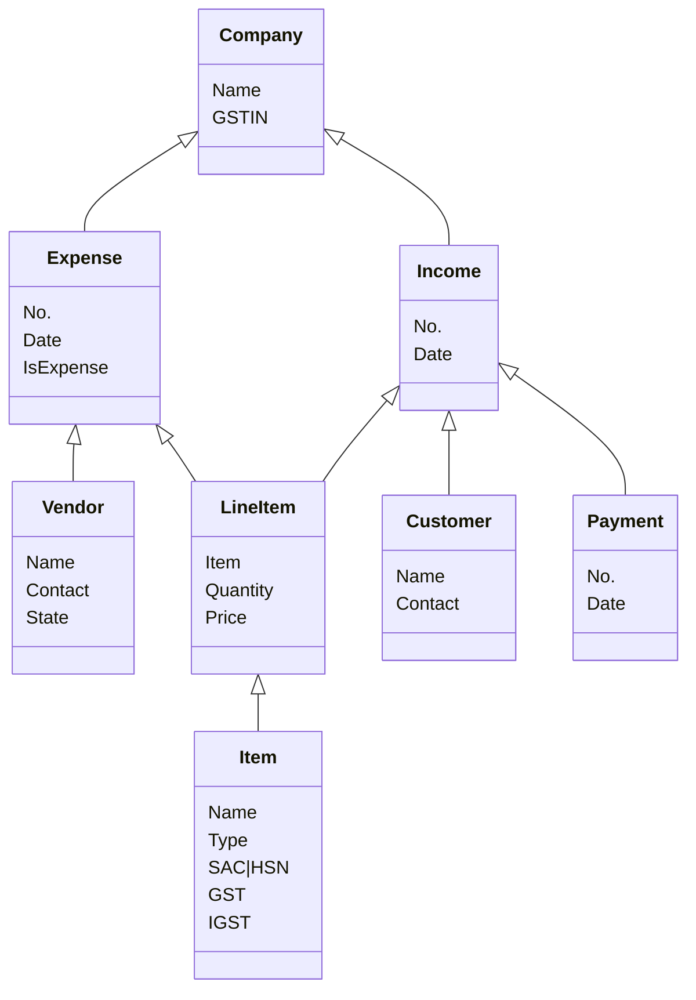

```mermaid
classDiagram

    class Company {
        Name
        GSTIN
    }
    
    class Expense {
        No.        
        Date
        IsExpense
    }

    class LineItem {
        Item
        Quantity
        Price
    }

    class Item {
        Name
        Type
        SAC|HSN
        GST
        IGST
    }

    class Vendor {
        Name
        Contact
        State
    }

    class Customer {
        Name
        Contact
    }

    class Income {
        No.
        Date
    }

    class Payment {
        No.
        Date
    }

    Company <|-- Expense
    Company <|-- Income
    

    Expense <|-- Vendor

    Income <|-- LineItem
    Expense <|-- LineItem
    
    Income <|-- Customer
    Income <|-- Payment

    LineItem <|-- Item

```